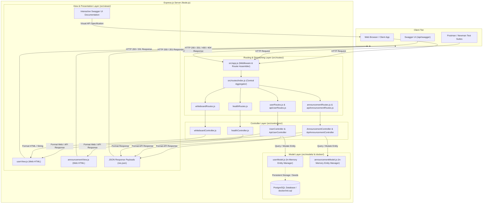

# 🎓 Alumni Tracking System

A modern, scalable, and secure **Alumni Tracking & Networking System** designed to bridge the gap between academic institutions and their graduates. This platform enables alumni to maintain up-to-date career profiles, fosters professional networking, and provides institutions with valuable insights into alumni outcomes and career trends.

---

## 📖 API Documentation (Swagger UI)

Interactive Swagger UI documentation is available for inspecting all endpoints, request/response models, and testing live API calls directly from your web browser:

* **Interactive Swagger UI:** [http://localhost:5000/api/swagger/](http://localhost:5000/api/swagger/) *(or [http://localhost:3000/api/swagger/](http://localhost:3000/api/swagger/))*
* **Alternative Docs URL:** [http://localhost:5000/api/docs/](http://localhost:5000/api/docs/)
* **OpenAPI 3.0 JSON Spec:** [http://localhost:5000/api/swagger.json](http://localhost:5000/api/swagger.json)

> [!IMPORTANT]
> **API Documentation Rule:** Whenever a new route is created or modified in the project, it must always be registered and documented in the Swagger specification (`src/config/swagger.js`) and listed in this documentation.

---

## 🛣️ API Endpoints Summary

### 🌐 RESTful API Endpoints (`ApiUserController` ➡️ `.../api/users`)
| Method | Endpoint | Description | Request Format |
| :--- | :--- | :--- | :--- |
| **GET** | `/api/swagger` | Interactive Swagger UI API documentation | - |
| **GET** | `/api/swagger.json` | OpenAPI 3.0 specification in JSON format | - |
| **GET** | `/api/health` | System health check (status, uptime, timestamp) | - |
| **GET** | `/api/users` | List all users as JSON (in-memory) | - |
| **POST** | `/api/users` | Create a new user (JSON API) | Form (`x-www-form-urlencoded`) or JSON |
| **GET** | `/api/users/:id` | Get single user details by numeric ID | - |
| **PUT** | `/api/users/:id` | Update all or multiple user details (API) | Form (`x-www-form-urlencoded`) or JSON |
| **PATCH**| `/api/users/:id` | Partially update user fields (API) | JSON or Form |
| **DELETE**| `/api/users/:id`| Remove a user from in-memory storage (API) | - |
| **GET** | `/api/announcements` | List all announcements as JSON | - |
| **POST** | `/api/announcements` | Publish new announcement (JSON API) | JSON |
| **GET** | `/api/announcements/:id` | Get single announcement by ID | - |
| **PUT** | `/api/announcements/:id` | Update announcement by ID (API) | JSON |
| **DELETE**| `/api/announcements/:id`| Delete announcement by ID (API) | - |

### 🖥️ Web / Application Endpoints (Dedicated View Layers)

#### 👥 Users Management (`UserController` ➡️ `.../users`)
| Method | Endpoint | Description | Layer / Format |
| :--- | :--- | :--- | :--- |
| **GET** | `/users` | **READ ALL:** Users directory table & embedded create form | HTML View / JSON |
| **POST** | `/users` | **CREATE:** Registration form submit & confirmation view | HTML View / JSON |
| **GET** | `/users/:id` | **READ ONE:** Individual user profile detail card | HTML View / JSON |
| **GET** | `/users/:id/edit` | **UPDATE (Form):** Pre-filled Edit User form view | HTML View |
| **POST** | `/users/:id/update`| **UPDATE (Action):** Submit form edits & render updated view | HTML View / JSON |
| **PUT** | `/users/:id` | **UPDATE (REST):** Full update user details by ID | JSON / HTML View |
| **PATCH**| `/users/:id` | **UPDATE (REST):** Partial update user details by ID | JSON / HTML View |
| **POST** | `/users/:id/delete`| **DELETE (Action):** Form delete submit & render directory view | HTML View / JSON |
| **DELETE**| `/users/:id`| **DELETE (REST):** Delete user by ID | JSON / HTML View |

#### 📢 Announcements Board (`AnnouncementController` ➡️ `.../announcements`)
| Method | Endpoint | Description | Layer / Format |
| :--- | :--- | :--- | :--- |
| **GET** | `/announcements` | **READ ALL:** Announcements board & publishing form | HTML View / JSON |
| **POST** | `/announcements` | **CREATE:** Publish announcement form submit & feedback view | HTML View / JSON |
| **GET** | `/announcements/:id` | **READ ONE:** Full announcement detail view card | HTML View / JSON |
| **GET** | `/announcements/:id/edit` | **UPDATE (Form):** Pre-filled Edit Announcement form view | HTML View |
| **POST** | `/announcements/:id/update`| **UPDATE (Action):** Submit edits & render updated view | HTML View / JSON |
| **PUT** | `/announcements/:id` | **UPDATE (REST):** Full update announcement details | JSON / HTML View |
| **PATCH**| `/announcements/:id` | **UPDATE (REST):** Partial update announcement details | JSON / HTML View |
| **POST** | `/announcements/:id/delete`| **DELETE (Action):** Form delete submit & render board view | HTML View / JSON |
| **DELETE**| `/announcements/:id`| **DELETE (REST):** Delete announcement by ID | JSON / HTML View |

### 📋 Whiteboard Classroom Routes
| Method | Endpoint | Description | Request Format |
| :--- | :--- | :--- | :--- |
| **GET** | `/` | Root endpoint (`ok` or `temporary one main page` in browser) | - |
| **GET** | `/hello` | Basic greeting (`Hello, World!`) | - |
| **GET** | `/hello/:name` | Dynamic personalized greeting (`Hello, {Name}!`) | - |
| **GET** | `/sum/:n1/:n2` | Calculates the sum of two numbers | - |
| **GET** | `/about` | Temporary about page (`temp. about page`) | - |
| **GET** | `/alumni` | Alumni base status route (`ok`) | - |

---

## 🛠️ Tech Stack

| Domain | Technology | Description |
| :--- | :--- | :--- |
| **Backend** | **Node.js** & **Express.js** | High-performance, asynchronous RESTful API architecture |
| **Documentation** | **Swagger / OpenAPI 3.0** | Interactive API exploration and testing interface (`swagger-ui-express`) |
| **Database** | **PostgreSQL** | Reliable, ACID-compliant relational database management system |
| **Containerization** | **Docker** & **Docker Compose** | Isolated micro-environments for development and production deployment |
| **API Testing** | **Postman** & **Newman** | Comprehensive test suites and collection automation |
| **Version Control & CI/CD** | **Git** & **GitHub** | Source control, collaborative workflows, and automated pipelines |

---

## 🏛️ Architecture: Model-View-Controller (MVC) Pattern

The **Alumni Tracking System** is engineered using the industry-standard **Model-View-Controller (MVC)** architectural design pattern. This pattern establishes a clean **Separation of Concerns (SoC)** by decoupling data persistence, application processing logic, and presentation interfaces into distinct, specialized layers.



---

### 📂 MVC Directory & Component Breakdown

The codebase is organized into modular directories reflecting each layer of the MVC pattern:

| MVC Layer | Directory / Folder | Core Files | Responsibility |
| :--- | :--- | :--- | :--- |
| **Model (M)** | `src/models/`<br>`docker/` | `userModel.js`<br>`announcementModel.js`<br>`init.sql` | Encapsulates business data structures, entity state, CRUD manipulation, and database schemas. |
| **View (V)** | `src/views/`<br>`src/config/` | `userView.js`<br>`announcementView.js`<br>`swagger.js`<br>`swagger.json`<br>JSON responses | Formats and delivers presentations to clients. Includes dedicated HTML templates (`userView.js` for users, `announcementView.js` for announcements), Swagger UI documentation, and JSON payloads. |
| **Controller (C)** | `src/controllers/` | `apiUserController.js`<br>`userController.js`<br>`apiAnnouncementController.js`<br>`announcementController.js`<br>`healthController.js`<br>`whiteboardController.js` | Receives client HTTP requests, validates input parameters, invokes Model operations, and formats the output View (REST JSON vs. Web HTML). |
| **Router / Dispatcher** | `src/routes/` | `index.js`<br>`apiUserRoutes.js`<br>`userRoutes.js`<br>`apiAnnouncementRoutes.js`<br>`announcementRoutes.js`<br>`healthRoutes.js`<br>`whiteboardRoutes.js` | Directs incoming HTTP requests (HTTP method + URI path) to the designated Controller handler. |
| **Infrastructure & Core** | Root & `src/` | `app.js`<br>`index.js` | Configures Express middlewares (JSON parser, URL-encoded parser), binds port listeners, and registers Swagger UI. |

---

### 🔍 In-Depth Layer Walkthrough: Directories, Folders & Files

#### 1. 🗄️ Model Layer (`src/models/` & `docker/`)
The **Model** represents the application's domain data, data structures, and the operations allowed upon that data.
* **`src/models/userModel.js`**:
  * **Entity State:** Maintains the in-memory array of user objects (`users = []`).
  * **Data Access Operations:** Implements complete CRUD helper functions decoupled from HTTP logic:
    * `create(userData)`: Generates auto-incrementing IDs, appends creation timestamps (`createdAt`), and saves the record.
    * `findAll()` / `getAll()`: Retrieves all registered user records.
    * `findById(id)` / `getById(id)`: Searches for a user matching a numeric identifier.
    * `findByEmail(email)`: Case-insensitive email lookup.
    * `update(id, updateData)`: Merges new field values, preserves immutable IDs, and tracks modification timestamps (`updatedAt`).
    * `delete(id)` / `remove(id)`: Removes a user from the collection and returns the deleted record.
    * `count()`: Reports the total number of stored users.
    * `clear()`: Empties in-memory storage (used for isolated unit testing).
* **`src/models/announcementModel.js`**:
  * **Entity State:** Maintains the in-memory collection of announcement objects (`announcements = []`).
  * **Data Access Operations:** Complete CRUD functions for campus & alumni announcements:
    * `create(data)`: Generates numeric IDs, assigns `createdAt`/`updatedAt`, defaults `priority: 'normal'`, and persists the announcement.
    * `findAll()` / `getAll()`: Retrieves all announcements sorted in reverse chronological order.
    * `findById(id)` / `getById(id)`: Retrieves a specific announcement by its numeric ID.
    * `findByCategory(category)`: Filters announcements matching a specific category (e.g. `Career`, `Event`, `Networking`).
    * `update(id, updateData)`: Updates fields and updates the `updatedAt` timestamp.
    * `delete(id)` / `remove(id)`: Removes an announcement from storage and returns the deleted record.
    * `count()`: Returns the total count of active announcements.
    * `clear()`: Empties in-memory storage for test isolation.
* **`docker/init.sql`**:
  * Defines the relational PostgreSQL schema (`users` table with primary keys, constraints, and timestamps) and initial seed data for persistent database operations.

#### 2. 🖥️ View & Presentation Layer (`src/views/` & `src/config/`)
The **View** layer is responsible for formatting data into standardized presentations for human users, browsers, mobile applications, and API consumers:
* **`src/views/userView.js` (Dedicated Users Web View)**:
  * Generates clean, responsive HTML view templates with embedded CSS:
    * `renderUsersList(users, options)`: Renders the **Users Directory** (`GET /users`) with a table of registered alumni and an embedded **User Registration Form** (`POST /users`), plus alert banners for feedback.
    * `renderUserDetail(user)`: Renders individual user profile card view (`GET /users/:id`).
    * `renderEditUserForm(user, options)`: Renders the pre-filled edit form view (`GET /users/:id/edit`).
    * `renderError(message, statusCode)`: Renders semantic error pages (400, 404).
* **`src/views/announcementView.js` (Dedicated Announcements Web View)**:
  * Generates modern responsive HTML templates for announcement management:
    * `renderAnnouncementsList(announcements, options)`: Renders the **Announcements Board** (`GET /announcements`) with priority badges, category chips, action triggers, and an embedded **Create Announcement Form** (`POST /announcements`).
    * `renderAnnouncementDetail(announcement)`: Full announcement detail view card (`GET /announcements/:id`) with metadata badges and navigation buttons.
    * `renderEditAnnouncementForm(announcement, options)`: Pre-filled edit form view (`GET /announcements/:id/edit`) supporting in-browser form updates.
    * `renderError(message, statusCode)`: Renders semantic error pages (400, 404).
* **RESTful JSON Presentation (`res.json`)**: Formats Model data into uniform JSON responses accompanied by semantic HTTP status codes (`200 OK`, `201 Created`, `400 Bad Request`, `404 Not Found`).
* **Interactive API Documentation View (`src/config/swagger.js` & `swagger.json`)**:
  * Powered by `swagger-ui-express` and OpenAPI 3.0.
  * Served at `/api/swagger` and `/api/docs` to provide a visual, interactive GUI where human users and developers can inspect schemas, parameters, and execute live requests.
* **HTML & Plain Text Views**: Browser-oriented endpoints (`/`, `/main`, `/about`, `/hello`, `/users`, `/announcements`) serving direct textual or HTML view representations.

#### 3. 🎮 Controller Layer (`src/controllers/`)
The **Controller** acts as the intermediary between the incoming HTTP request, the Model layer, and the View layer. The system provides dedicated controllers to cleanly separate API serialization from Web views:
* **`src/controllers/apiUserController.js` (ApiUserController)**:
  * Dedicated to RESTful API consumers, Postman, mobile clients, and Swagger UI (`/api/users`).
  * `createUser`, `getAllUsers`, `getUserById`, `updateUser`, `deleteUser`.
* **`src/controllers/userController.js` (UserController)**:
  * Dedicated to standard web clients and browser interactions (`/users`).
  * Supports HTML rendering with CSS when requested by browsers (`Accept: text/html`), while gracefully supporting JSON fallback.
* **`src/controllers/apiAnnouncementController.js` (ApiAnnouncementController)**:
  * Dedicated RESTful JSON CRUD controller for `/api/announcements`.
  * `createAnnouncement`, `getAllAnnouncements`, `getAnnouncementById`, `updateAnnouncement`, `deleteAnnouncement`.
* **`src/controllers/announcementController.js` (AnnouncementController)**:
  * Dedicated Web CRUD controller for `/announcements` with full HTML View layer integration (`getAllAnnouncements`, `getAnnouncementById`, `createAnnouncement`, `getEditAnnouncementForm`, `updateAnnouncement`, `deleteAnnouncement`).
* **`src/controllers/healthController.js`**:
  * `getHealth(req, res)`: Computes server health metrics (`uptime`, system timestamp, status string) and formats the response.
* **`src/controllers/whiteboardController.js`**:
  * Contains request handlers for classroom routes (`getRoot`, `getHello`, `getHelloNamed`, `getSum`, `getMain`, `getAbout`, `getAlumni`), handling URL parameter parsing and response rendering.

#### 4. 🚦 Routing & Dispatching Layer (`src/routes/`)
Decouples URL route matching from business logic:
* **`src/routes/apiUserRoutes.js`**: Maps `.../api/users` endpoints to `ApiUserController`.
* **`src/routes/userRoutes.js`**: Maps `.../users` web endpoints to `UserController`.
* **`src/routes/apiAnnouncementRoutes.js`**: Maps `.../api/announcements` endpoints to `ApiAnnouncementController`.
* **`src/routes/announcementRoutes.js`**: Maps `.../announcements` web endpoints to `AnnouncementController`.
* **`src/routes/healthRoutes.js`**: Registers `GET /api/health` and `GET /health` mapped to `healthController.getHealth`.
* **`src/routes/whiteboardRoutes.js`**: Registers introductory educational routes mapped to `whiteboardController`.
* **`src/routes/index.js`**: Central aggregator that combines all modular sub-routers and serves the OpenAPI specification endpoints (`/api/swagger.json`, `/swagger.json`).

#### 5. ⚙️ Application Entry Point & Infrastructure
* **`src/app.js`**: Configures the Express instance, attaches global middlewares (`express.json()`, `express.urlencoded()`), mounts Swagger UI, and binds the central router.
* **`index.js`**: Main executable script that initializes the HTTP listeners on both port `5000` (default) and port `3000` (alternate).
* **`test/`**: Comprehensive automated test suites (80 tests across all model, controller, route, and view test files).

---

### 🔄 MVC Request-Response Lifecycle Example

To illustrate the MVC flow during execution, consider a client submitting **`POST /api/users`**:

1. **Client Request:** The client sends an HTTP `POST` request to `http://localhost:5000/api/users` with payload `{ "name": "Ece Yakali", "email": "ece@example.com" }`.
2. **Listener & Middleware (`index.js` -> `src/app.js`):** The server receives the request; Express body-parser middleware parses the request body into `req.body`.
3. **Router Dispatch (`src/routes/index.js` -> `src/routes/userRoutes.js`):** The router matches `POST /api/users` and passes execution to `apiUserController.createUser`.
4. **Controller Processing (`src/controllers/apiUserController.js`):** The controller validates that the payload is non-empty.
5. **Model Mutation (`src/models/userModel.js`):** The controller calls `userModel.create(req.body)`. The model assigns an ID, appends timestamps, stores the record, and returns the entity.
6. **View Formatting (`res.status(201).json(...)`):** The controller packages the newly created entity into a standardized JSON response view.
7. **Client Response:** Express transmits the HTTP 201 response back to the client.

---

## 📁 Project Directory Structure

```text
alumni/
├── docker/                             # Containerization and database assets
│   └── init.sql                        # Initial PostgreSQL schema & seed data (Model layer)
├── postman/                            # Postman workspace environment and collection files
├── src/                                # Application source code (MVC Architecture)
│   ├── config/                         # Environment & API documentation configurations
│   │   └── swagger.js                  # OpenAPI 3.0 specification definition (View layer)
│   ├── controllers/                    # Controller Layer (Request orchestration & business flow)
│   │   ├── apiAnnouncementController.js# Dedicated RESTful API CRUD Controller for Announcements
│   │   ├── announcementController.js   # Web/Application CRUD Controller for Announcements (HTML/View)
│   │   ├── apiUserController.js        # Dedicated RESTful API CRUD Controller for Users (JSON responses)
│   │   ├── userController.js           # Web/Application CRUD Controller for Users (HTML/content-negotiated)
│   │   ├── healthController.js         # System health & uptime metric handler
│   │   └── whiteboardController.js     # Classroom introductory routes & calculation handlers
│   ├── models/                         # Model Layer (Data structures & entity manipulation)
│   │   ├── announcementModel.js        # Announcement entity data store & CRUD operations
│   │   └── userModel.js                # User entity data store & CRUD operations
│   ├── routes/                         # Router Layer (HTTP verb & URL route definitions)
│   │   ├── apiAnnouncementRoutes.js    # Routes for .../api/announcements -> ApiAnnouncementController
│   │   ├── announcementRoutes.js       # Routes for .../announcements -> AnnouncementController
│   │   ├── apiUserRoutes.js            # Routes for .../api/users -> ApiUserController
│   │   ├── healthRoutes.js             # Routes for /api/health -> HealthController
│   │   ├── index.js                    # Aggregated master router & Swagger JSON endpoints
│   │   ├── userRoutes.js               # Routes for .../users -> UserController
│   │   └── whiteboardRoutes.js         # Routes for classroom endpoints (/, /hello, /sum, etc.)
│   ├── views/                          # View Layer (HTML page templates & UI rendering)
│   │   ├── announcementView.js         # Announcements board, card view & publishing form
│   │   └── userView.js                 # Users directory table, profile view & registration form
│   └── app.js                          # Express application configuration & middleware setup
├── test/                               # Automated test suites (Node.js native test runner - 80 tests)
│   ├── announcementControllers.test.js # Unit tests for ApiAnnouncementController & AnnouncementController
│   ├── announcementModel.test.js       # Unit tests for Announcement Model in-memory CRUD operations
│   ├── announcementView.test.js        # Unit and integration tests for Announcement HTML View layer
│   ├── controllers.test.js             # Unit tests for ApiUserController & UserController CRUD
│   ├── routes.test.js                  # Integration tests validating all API, Web & Swagger endpoints
│   ├── userModel.test.js               # Unit tests for User Model in-memory CRUD operations
│   └── userView.test.js                # Unit and integration tests for User HTML View layer
├── .dockerignore                       # Files excluded from Docker container build
├── .env.example                        # Sample environment variable template
├── .gitignore                          # Git tracking exclusion list
├── alumni.postman_collection.json      # Exported Postman collection for automated API testing
├── docker-compose.yml                  # Multi-container orchestration (Node.js API + PostgreSQL)
├── Dockerfile                          # Production-ready container image for the Node.js API
├── index.js                            # Server entry point (listens on ports 5000 & 3000)
├── package.json                        # Node.js project manifest & scripts
├── swagger.json                        # OpenAPI 3.0 static specification file
└── README.md                           # Comprehensive project documentation
```

---

## ⚙️ Getting Started

### 📋 Prerequisites
Ensure you have the following installed on your machine:
- [Git](https://git-scm.com/)
- [Node.js](https://nodejs.org/) (v18 or higher) & npm
- [Docker](https://www.docker.com/) & [Docker Compose](https://docs.docker.com/compose/)
- [Postman](https://www.postman.com/) (installed for manual and collection testing)

---

### 📥 1. Clone the Repository

```bash
git clone https://github.com/ecemyakali/alumni.git
cd alumni
```

---

### 💻 2. Local Development (Without Docker)

1. **Install Dependencies:**
   ```bash
   npm install
   ```

2. **Start the Server:**
   ```bash
   # Development mode with auto-reload (Node.js native watch mode)
   npm run dev

   # Production start
   npm start
   ```
   *The server starts listening on both `http://localhost:5000` and `http://localhost:3000`.*

3. **Run Automated Tests:**
   ```bash
   npm test
   ```
   *Executes all 80 automated test cases covering health checks, user & announcement CRUD, routing, views, and Swagger specs.*

---

### 🐳 3. Quick Start with Docker

To spin up both the **Node.js API** and the **PostgreSQL database** in isolated containers:

```bash
# Start containers in detached mode
docker compose up --build -d

# Follow container logs
docker compose logs -f
```

The API service will be accessible at `http://localhost:3000` / `http://localhost:5000`.

---

## 🧪 Postman & Automated API Testing

A complete Postman collection is maintained in the root directory:
* **`alumni.postman_collection.json`**

You can:
1. **Import in Postman:** Click **Import** in Postman Desktop and select `alumni.postman_collection.json` to immediately access all pre-configured requests with automated test assertions.
2. **Run via Newman CLI:**
   ```bash
   npx newman run alumni.postman_collection.json
   ```

---

## 🗺️ Roadmap

- [x] Project initialization with Express.js
- [x] Docker and Docker Compose environment orchestration (`Dockerfile`, `docker-compose.yml`)
- [x] Introductory routes (`/`, `/hello`, `/hello/:name`, `/sum/:n1/:n2`, `/about`, `/alumni`)
- [x] System health check endpoint (`GET /api/health`)
- [x] In-memory user management CRUD operations (`POST`, `GET`, `PUT`, `PATCH`, `DELETE /api/users`)
- [x] Dedicated User View layer with HTML CRUD interface (`GET`, `POST`, `PUT`, `DELETE /users`)
- [x] Homework: In-memory announcement management without database (`AnnouncementModel`, `AnnouncementController`, `ApiAnnouncementController`)
- [x] Homework: Dedicated Announcement View layer with HTML CRUD board (`GET`, `POST`, `PUT`, `DELETE /announcements`)
- [x] Interactive Swagger UI documentation with User and Announcement APIs (`GET /api/swagger`)
- [x] Automated unit and integration testing suite (80/80 tests passing)
- [ ] PostgreSQL schema modeling and persistent database integration
- [ ] JWT authentication and role-based authorization middleware
- [ ] Advanced alumni search, filter, and pagination APIs
- [ ] GitHub Actions CI/CD deployment pipelines

---

## 🤝 Contributing

1. **Fork** the repository
2. Create your feature branch (`git checkout -b feature/AmazingFeature`)
3. Ensure new routes are added to `src/config/swagger.js` and `README.md`
4. Commit your changes (`git commit -m 'feat: Add AmazingFeature'`)
5. Push to the branch (`git push origin feature/AmazingFeature`)
6. Open a **Pull Request**

---

## 📄 License

This project is licensed under the [MIT License](LICENSE).
